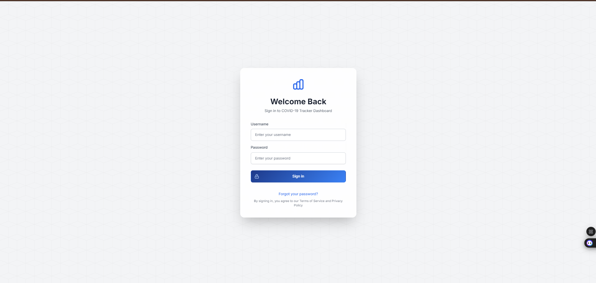
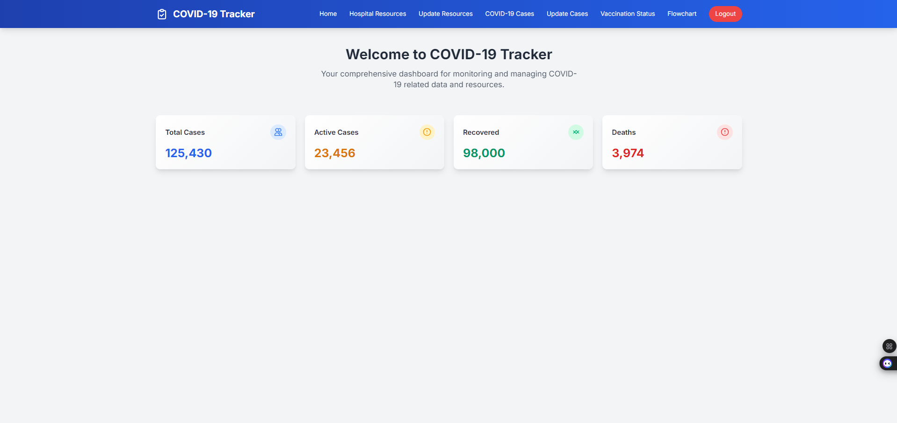
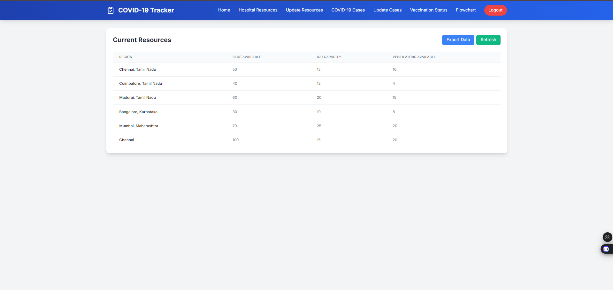
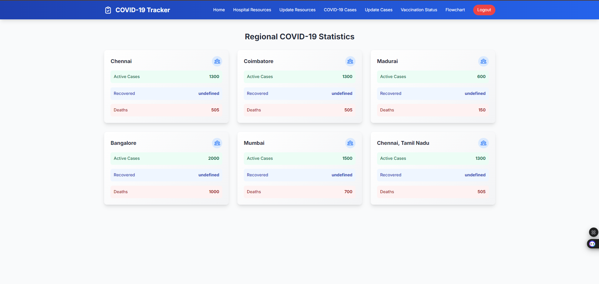
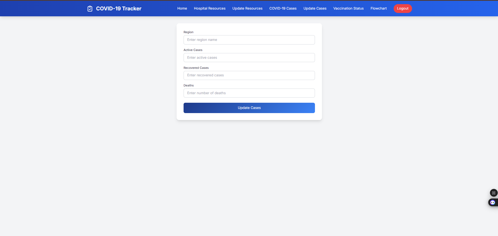
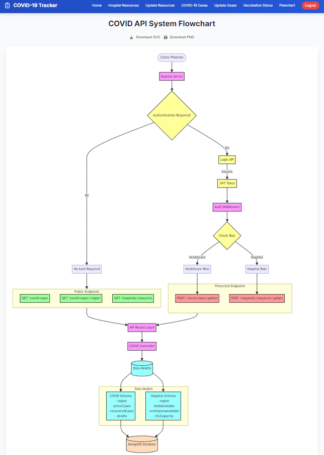

# COVID-19 Tracker: Hospital Resources, Cases, and Vaccination Status

## 📊 Project Overview

This comprehensive COVID-19 Tracker and Information System provides a user-friendly interface for monitoring and managing hospital resources, COVID-19 case data, and vaccination status. It features both a **frontend** (HTML, CSS, JavaScript) and a **backend** (Node.js, Express, MongoDB), allowing users to view real-time hospital resources, update hospital information, and track vaccination progress across various regions.

## 🌟 Key Features

- 🏥 **Hospital Resources:** Real-time view of available beds, ICU beds, ventilators, and oxygen cylinders
- 🦠 **COVID-19 Cases:** Monitor and update case numbers by region
- 💉 **Vaccination Status:** Track vaccination progress across different areas
- 🔐 **Authentication:** Secure login system with token-based authentication
- 📱 **Responsive Design:** Fully adaptive layout for all devices
- 🔀 **Flowchart:** Visual representation of the app workflow

## 📚 Table of Contents

1. [Project Setup](#-project-setup)
2. [Usage Guide](#-usage-guide)
3. [Screenshots](#-screenshots)
4. [Technologies Used](#-technologies-used)
5. [Contributing](#-contributing)
6. [License](#-license)
7. [Acknowledgements](#-acknowledgements)

## 🛠 Project Setup

### Frontend Setup

1. **Clone the repository:**

   ```bash
   git clone https://github.com/your-username/covid-19-tracker.git
   cd covid-19-tracker/frontend
2. **Install dependencies:**

Make sure you have Node.js and npm installed. Then, install the required dependencies:

```bash
npm install
```

3. **Run the Frontend:**

Start the frontend development server:

```bash
npm start
```

The app will be accessible at http://localhost:3000 by default.

4. **Update API Endpoints:**

In the frontend folder, go to index.js (or any other relevant JS file) and make sure the API URL is correct.

```javascript
const response = await fetch('http://127.0.0.1:5000/api/covid/hospitals/resources');
```

Replace http://127.0.0.1:5000 with your backend API URL if deployed remotely.

## Backend Setup

### Navigate to backend directory:
```bash
cd covid-19-tracker/backend
```

### Install Dependencies:

Ensure you have Node.js and npm installed. Then, install the necessary dependencies:

1. **Install Dependencies:**

```bash
npm install
```

2. **Set Up MongoDB:**

Make sure you have MongoDB installed and running locally, or use MongoDB Atlas for a cloud-based database.

3. **Local MongoDB:**

```bash
mongod
```

### Cloud MongoDB (MongoDB Atlas):

Create a MongoDB Atlas account.
Create a new cluster and get the connection string.
Update server.js with your connection string.

### Run the Backend:

Start the backend server:

```bash
node server.js
```

The backend will be accessible at http://localhost:5000 by default.


## 📋 Usage Guide

### 🔐 Login
Upon visiting the app, users will be greeted with a login screen. Our secure authentication system utilizes JWT (JSON Web Tokens) to ensure the safety of your data.

### 📊 View Hospital Resources
Once logged in, users gain access to a comprehensive table showcasing vital hospital resources:

- 🛏️ Hospital Beds
- 🏥 ICU Beds  
- 🫁 Ventilators
- 🧪 Oxygen Cylinders

### 🔄 Update Resources
Administrators have the ability to keep resource information up-to-date:

1. Navigate to the update form
2. Enter new values for each resource 
3. Submit the form to refresh the data

### 🦠 COVID-19 Case Tracker
Stay informed with our real-time COVID-19 case tracker, providing total case numbers for your specific region.

### 💉 Vaccination Status 
Monitor vaccination progress in your area:

- View current vaccination rates
- Update vaccination statuses as needed

### 🚪 Logout
To end your session securely, simply click the "Logout" button in the navigation menu.

🌟

## Screenshots

Login Page


Home Page
  <!-- Make sure to update this path if it was incorrect -->

Hospital Resources Page


Update Hospital Resources


COVID-19 Cases Page


Vaccination Status Page


Flowchart Page




# 🛠️ Technical Details

## 💻 Technologies Used

### 🎨 Frontend
- **HTML** - Structure and content
- **CSS** - Styling and layout
- **JavaScript** - Client-side functionality
- **Fetch API** - HTTP requests

### ⚙️ Backend
- **Node.js** - Runtime environment
- **Express.js** - Web framework
- **MongoDB** - Database
- **Mongoose** - ODM library

### 🔧 Additional Tools
- **JWT** - Authentication & security
- **Postman** - API testing
- **Git** - Version control

## 🤝 Contributing

We welcome contributions! Here's how you can help:

1. Fork the repository

2. Create your feature branch:
   ```bash
   git checkout -b feature-name
   ```

3. Commit your changes
   ```bash
   git commit -am 'Add new feature'
   ```

4. Push to the branch 
   ```bash
   git push origin feature-name
   ```

5. Create a new Pull Request

## 📜 License

<div align="center">
  
</div>

This project is licensed under the [MIT License](LICENSE). For more details, please see the LICENSE file.

---

## ✨ Acknowledgements

<div align="center">
  
</div>

### Data Provider
- [COVID-19 Data API](https://covid19api.com/) for providing comprehensive and real-time pandemic data

### Community Support
- 👥 All amazing contributors who helped improve this project
- 📚 Open-source libraries and their maintainers
- 🏥 Healthcare workers who inspired this initiative

<div align="center">
  <sub>Built with ❤️ for the healthcare community</sub>
</div>

---

<div align="center">
  
  **[⬆ Back to Top](#-license)**
  
  
  
</div>
